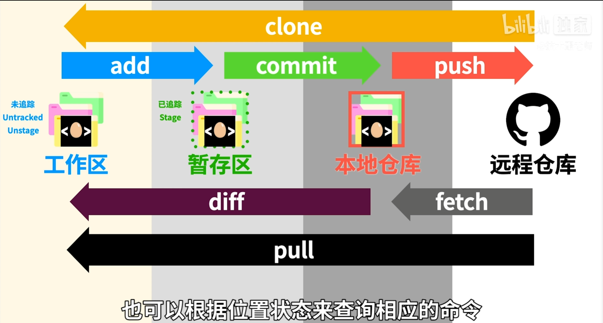

# Git 学习


## 推荐学习地址

[Git视频地址1](https://www.bilibili.com/video/BV1r3411F7kn/?spm_id_from=333.337.search-card.all.click&vd_source=ef384a057062657211d40f7ef83336f7)

[Git视频地址2](https://www.bilibili.com/video/BV1p1421z7Hh/?spm_id_from=pageDriver&vd_source=ef384a057062657211d40f7ef83336f7)

## 笔记

### git flow



**工作区** `add` **暂存区** `commit` **本地仓库(本地版本区)** `push` **远程仓库**

- **远程仓库** `fetch` **工作仓库**
- **工作仓库** `diff` **进行对比**
- **远程仓库** `pull` **工作区**

**工作区：** 为追踪状态 Untracked or Unstage;
**暂存区：** 已追踪 Stage;

**工作区，暂存区和本地版本区都会在创建的文件夹里操作**

**设置用户名及**：

```bash {.line-numbers}
git config --global user.name syfan
git config --global user.email syf1913@163.com
```

**对文件夹进行版本控制，即初始化`git init`，默认分支为`master`，并且之后所有的记录都会在`.git`文件夹中，可以使用`git status`来查看状态。**

**添加信息`git commit -m "..."`**

**查看历史版本`git log`**

**忽略不需要提交的文件，将文件名以及后缀写入`.gitignore`**

### 分支

**创建分支`git branch 分支名`，同时也可以使用`git branch`查看所所有分支(按`q`退出)**

**切换分支`git checkout 分支名`，文件夹里的文件是直接从`master`主支复制过来的**

**删除分支`git branch -d or -D 分支名`**

**`git checkout -b `，即创建分支的同时跳转至新创建的分支(`-b -> -branch`)**

**`git merge 分支名`，即把别的分支合并到当前所处的分支上**

**`git remote -v`，查看本地仓库与哪些远程仓库有联系**

**用`origin`，默认表示远程仓库的名字，`push`的时候就可以用`origin`代替原来的`URL`**

**`git fetch`，远程仓库到本地版本库**

**`git diff`，查看远程仓库与本地仓库(工作区)的区别**

**`git pull`，拉取远程仓库到本地仓库(工作区)**

### `git rebase`

`git rebase` 是 Git 中一个非常强大且重要的命令，用于重新应用分支上的提交。它的主要目的是通过将一系列提交移动到一个新的基础提交上，从而使项目历史更加线性和整洁。为了更好地理解它，让我们详细解释 `git rebase` 的各个方面。

#### 什么是 Git Rebase

`git rebase` 会将当前分支上的提交重新应用到另一个分支的顶部。换句话说，它会把当前分支的基础更改为另一个分支的末端。

#### 基本用法

```bash
git rebase <branch>
```

这里的 `<branch>` 是你想要重新基于的分支。例如，如果你在 `feature` 分支上，并且你想要将 `feature` 分支的更改重新应用到 `main` 分支的最新提交上，你会执行：

```bash
git rebase main
```

#### Rebase 过程

假设你的提交历史如下：

```bash
A---B---C feature
     /
D---E---F---G main
```

执行 `git rebase main` 后，`feature` 分支的提交会被移动到 `main` 分支的顶部，新的提交历史会是：

```
D---E---F---G---A'---B'---C' feature
                   /
                 main
```

#### Rebase 的主要应用场景

1. **保持提交历史整洁**：通过 rebase 可以将分支的所有提交应用到一个新的基础提交上，使得历史更加线性和整洁。
2. **整合分支**：在合并特性分支到主分支之前，使用 rebase 将特性分支的提交整合到主分支的最新提交上，使得合并更加清晰。

#### 交互式 Rebase

交互式 rebase 是 `git rebase` 的一种模式，可以让你在 rebase 过程中编辑、合并、删除或重排提交。使用以下命令启动交互式 rebase：

```bash
git rebase -i <base-branch>
```

`<base-branch>` 是你希望基于的分支。例如：

```bash
git rebase -i main
```

这将打开一个文本编辑器，显示一系列提交。每行代表一个提交，格式如下：

```
pick <commit-hash> <commit-message>
```

你可以将 `pick` 替换为以下命令之一：

- `pick`：保留该提交（默认）。
- `reword`：保留该提交，但修改提交信息。
- `edit`：保留该提交，但在应用时暂停，以便你可以进行修改。
- `squash`：将该提交与前一个提交合并。
- `fixup`：将该提交与前一个提交合并，但丢弃该提交的提交信息。
- `drop`：删除该提交。

#### 处理冲突

在 rebase 过程中，可能会遇到冲突。Git 会暂停 rebase 并提示你解决冲突。解决冲突后，你需要执行以下命令继续 rebase：

```bash
git add <resolved-files>
git rebase --continue
```

如果决定放弃 rebase 过程，可以使用以下命令：

```bash
git rebase --abort
```

#### Rebase 和 Merge 的区别

- **Rebase**：会重新应用提交，使提交历史更加线性和整洁，适用于代码审查和合并请求前的清理。
- **Merge**：会创建一个新的合并提交，将两个分支的历史保留在一起，适用于需要保留完整开发历史的场景。

#### 注意事项

- **共享分支上的 Rebase**：避免在共享分支上使用 rebase，因为它会重写历史，可能导致其他开发人员的工作出现问题。
- **备份**：在进行 rebase 之前，建议创建一个备份分支，以防出错。

#### 总结

`git rebase` 是一个强大的工具，用于重写提交历史，使其更加整洁和线性。它可以在合并分支之前清理提交历史，适合进行代码审查和维护清晰的提交历史。在使用 `git rebase` 时，要注意避免在共享分支上使用，并且在处理冲突时要小心操作。

### `git pull`

`git pull` 是一个 Git 命令，用于从远程仓库获取最新的更改并将其合并到当前分支。这个命令是 `git fetch` 和 `git merge` 的组合。为了详细解释，我们可以分解这个命令的各个部分并讨论其工作原理、用法和常见应用场景。

#### 基本概念

##### 1. `git fetch`

`git fetch` 是 Git 的一个子命令，用于从远程仓库下载所有的更改，但不将这些更改合并到当前分支。它只是更新了远程分支的引用。

```bash
git fetch origin
```

##### 2. `git merge`

`git merge` 是 Git 的一个子命令，用于将一个分支的更改合并到当前分支。

```bash
git merge origin/main
```

##### 3. `git pull`

`git pull` 是 `git fetch` 和 `git merge` 的组合。它从远程仓库下载更改并立即将其合并到当前分支。

```bash
# 用于从名为 origin 的远程仓库的 main 分支获取最新的更改，
# 并将这些更改合并到当前所在的本地分支。
git pull origin main
```

#### 工作流程

1. **获取最新更改**：
   `git pull` 首先执行 `git fetch`，下载远程仓库中最新的提交，并更新本地的远程跟踪分支。例如，`origin/main` 分支会更新到远程仓库中的最新状态。

2. **合并更改**：
   然后，`git pull` 执行 `git merge`，将刚刚获取的更改合并到当前分支。如果有冲突，Git 会提示你解决冲突。

#### 具体用法

##### 1. 默认用法

```bash
git pull
```

这个命令会从当前分支的默认上游分支拉取更改并合并。如果当前分支没有设置上游分支，Git 会提示你指定一个。

##### 2. 指定远程和分支

```bash
git pull origin main
```

这个命令会从 `origin` 远程仓库的 `main` 分支拉取更改并合并到当前分支。

##### 3. 仅获取更改而不合并

如果你只想获取更改而不进行合并，可以使用 `git fetch`：

```bash
git fetch origin
```

然后你可以查看更改，并选择是否合并：

```bash
git merge origin/main
```

#### 处理冲突

在执行 `git pull` 时，可能会遇到合并冲突。解决冲突的步骤如下：

1. **查看冲突文件**：Git 会标记有冲突的文件。
2. **解决冲突**：手动编辑冲突文件，解决冲突部分。
3. **标记解决冲突**：使用 `git add` 将解决冲突的文件标记为已解决。

```bash
git add <resolved-file>
```

4. **继续合并**：完成冲突解决后，继续合并：

```bash
git commit
```

或使用：

```bash
git merge --continue
```

#### 使用 `--rebase` 选项

`git pull` 可以使用 `--rebase` 选项，以 rebase 代替 merge：

```bash
git pull --rebase origin main
```

这样，拉取的更改会被应用到当前分支的基础之上，而不是直接合并。这可以使提交历史更加线性。


#### 常见应用场景

1. **保持分支最新**：
   开发过程中，频繁使用 `git pull` 可以确保你的分支包含远程仓库的最新更改，避免与团队其他成员的工作产生冲突。

2. **合并远程工作**：
   当你在一个分支上完成开发并准备合并到主分支时，使用 `git pull` 确保你有远程仓库中的最新更改，然后再合并。

3. **解决冲突**：
   如果远程仓库中的更改与本地工作产生冲突，`git pull` 会提示并允许你解决冲突，确保代码库的一致性。

#### 小结

`git pull` 是 Git 中的一个重要命令，结合了 `git fetch` 和 `git merge` 的功能，用于从远程仓库获取最新更改并将其合并到当前分支。它简化了保持分支与远程仓库同步的操作，但在使用过程中要注意可能的冲突和合并策略（如使用 `--rebase` 选项）。了解并正确使用 `git pull` 对于团队协作和代码管理非常重要。

### `git push`

`git push` 是一个 Git 命令，用于将本地仓库中的提交推送到远程仓库。这是 Git 工作流程中的一个关键步骤，特别是在协作开发环境中。下面是对 `git push` 命令的详细解释，包括其基本用法、参数和常见应用场景。

#### 基本概念

`git push` 命令用于将本地分支的更改上传到远程仓库，从而使这些更改可以被其他协作者获取。该命令的基本语法如下：

```bash
git push <remote> <branch>
```

- **`<remote>`**: 远程仓库的名称（例如 `origin`）。
- **`<branch>`**: 本地分支的名称（例如 `main`）。

#### 工作流程

当你执行 `git push` 时，Git 会进行以下操作：

1. **检查本地分支的更改**：
   Git 会查看本地分支的提交与远程分支的提交之间的差异。

2. **上传本地更改**：
   Git 将本地分支的提交上传到指定的远程仓库的对应分支。如果远程分支不存在，Git 会在远程仓库中创建它。

#### 示例

假设你在本地仓库中有一个名为 `main` 的分支，你想将该分支的更改推送到远程仓库 `origin` 中的 `main` 分支，可以使用以下命令：

```bash
# main 为本地分支的名称
# 你可以推送到远程仓库中的任何分支。
# 如果远程仓库中没有该分支，Git 会在推送时创建它。
git push origin main
```

如果你在当前分支上，并且该分支已经设置了上游分支（upstream branch），可以简化为：

```bash
git push
```

#### 设置上游分支

第一次推送本地分支到远程仓库时，可以使用 `-u` 选项来设置上游分支：

```bash
git push -u origin main
```

这样，Git 会将 `origin/main` 设置为本地 `main` 分支的上游分支，以后在该分支上推送和拉取时可以省略远程和分支名称。

#### 强制推送

在某些情况下，你可能需要强制推送更改（例如，当本地分支和远程分支的提交历史不一致时）。强制推送使用 `--force` 选项：

```bash
git push --force origin main
```

**注意**：强制推送会覆盖远程分支的历史，可能导致其他协作者的工作丢失，因此要谨慎使用。

#### 推送所有分支

如果你想一次性推送所有分支，可以使用 `--all` 选项：

```bash
git push --all origin
```

#### 推送标签

你可以推送所有标签或特定标签到远程仓库：

```bash
git push origin --tags
```

#### 常见应用场景

1. **协作开发**：
   多人协作时，频繁推送更改以保持远程仓库的最新状态，确保团队成员能够获取最新的代码。

2. **部署代码**：
   一些自动化部署流程依赖于将代码推送到远程仓库特定分支，以触发部署脚本或 CI/CD 管道。

3. **备份代码**：
   将本地仓库的更改推送到远程仓库，以确保代码有备份，防止本地数据丢失。

#### 常见问题和解决方法

1. **拒绝推送（`rejected`）**：
   如果远程仓库包含本地仓库没有的提交，Git 会拒绝推送以防止丢失数据。解决方法是先拉取远程更改并解决冲突：

   ```bash
   git pull origin main
   ```

   然后再推送：

   ```bash
   git push origin main
   ```

2. **冲突解决**：
   在拉取远程更改时可能会遇到冲突，需要手动解决冲突，然后再提交和推送：

   ```bash
   git add <resolved-files>
   git commit
   git push origin main
   ```

#### 总结

`git push` 是将本地提交推送到远程仓库的命令，在协作开发和代码管理中起着至关重要的作用。通过理解 `git push` 的工作原理和使用方法，可以更有效地管理代码库和协作开发过程。


### 要将本地的特定分支推送到远程仓库中的特定分支

```bash
git push <remote> <local-branch>:<remote-branch>
```

#### 具体步骤

1. **确认本地和远程分支的名称**
   - 本地分支：你希望推送的本地分支的名称。
   - 远程分支：你希望推送到的远程分支的名称。如果远程分支不存在，Git 会在远程仓库中创建它。

2. **推送本地分支到远程分支**
   使用 `git push` 命令，并指定本地分支和远程分支的名称。

#### 示例

假设你有一个本地分支 `feature-branch`，你希望将其推送到远程仓库 `origin` 的分支 `remote-feature-branch`，可以按照以下步骤操作：

1. **查看当前分支**：
   确认你所在的分支是 `feature-branch`。如果不是，切换到 `feature-branch`：

   ```bash
   git checkout feature-branch
   ```

2. **推送本地分支到远程分支**：
   使用以下命令将本地 `feature-branch` 推送到远程 `origin` 的 `remote-feature-branch`：

   ```bash
   git push origin feature-branch:remote-feature-branch
   ```

#### 详细解释

- `git push`：Git 推送命令。
- `origin`：远程仓库的名称。
- `feature-branch`：本地分支的名称。
- `remote-feature-branch`：远程分支的名称。

#### 其他常见场景

1. **推送本地分支到远程同名分支**：
   如果本地分支和远程分支同名，你可以简化命令：

   ```bash
   git push origin feature-branch
   ```

2. **推送本地新分支到远程新分支**：
   如果本地分支是新创建的，远程仓库中还没有对应的分支，直接使用上面的命令也会在远程创建新分支。

3. **删除远程分支**：
   如果需要删除远程分支，可以使用以下命令（注意，冒号前没有本地分支的名称）：

   ```bash
   git push origin :remote-branch
   ```

#### 小结

通过上述方法，你可以灵活地将本地的特定分支推送到远程的特定分支，以便在团队协作中更好地管理代码分支。确保在推送前同步最新的远程分支状态，以避免潜在的合并冲突。

### 如果你在本地仓库中进行了修改，但现在不想保留这些修改，并希望退回到最初从远程仓库拉取的状态，可以使用以下 Git 命令。

这里的操作分为两种情况：仅有未提交的更改和已经有提交但未推送的更改。

#### 情况 1：仅有未提交的更改

如果你在本地文件中做了更改但还没有提交，可以使用 `git restore` 或 `git checkout` 来丢弃这些未提交的更改。

##### 方法 1：使用 `git restore`

```bash
git restore .
```

这将恢复所有未提交的更改，使工作目录中的文件回到最新的提交状态。

##### 方法 2：使用 `git checkout`

```bash
git checkout -- .
```

这同样会丢弃所有未提交的更改，使工作目录中的文件恢复到最新的提交状态。

#### 情况 2：已经有提交但未推送的更改

如果你已经将更改提交到本地仓库，但还没有推送到远程仓库，你需要重置分支到上游分支（即远程分支的最新状态）。

##### 方法：使用 `git reset`

```bash
git fetch origin
git reset --hard origin/main
```

以上命令的解释如下：

1. **`git fetch origin`**：从远程仓库获取最新的更改，但不合并。
2. **`git reset --hard origin/main`**：将当前分支的 HEAD 重置为远程 `main` 分支的最新提交，并丢弃所有本地的更改和提交。

#### 注意事项

- 使用 `--hard` 选项会丢弃所有未提交的更改和提交，请确保你不需要保留这些更改。如果你对某些更改还不确定，可以考虑先备份当前工作目录。
- 上面的命令假设你要重置的分支是 `main`。如果你使用的是其他分支名称，请替换 `main` 为相应的分支名称。

### 小结

通过上述方法，你可以轻松地将本地仓库恢复到最初从远程仓库拉取的状态，确保丢弃所有不需要的本地更改。

### 要查看远程仓库的提交历史并将其与本地的提交历史进行对比，可以使用 Git 提供的一些命令和选项。

#### 1. 查看远程仓库的提交历史

首先，你需要确保从远程仓库获取了最新的提交信息。你可以使用 `git fetch` 命令从远程仓库拉取最新的提交历史，而不合并这些更改。

```bash
git fetch origin
```

这里的 `origin` 是远程仓库的默认名称，如果你有其他名称，请替换相应的名称。

接下来，你可以使用 `git log` 查看远程分支的提交历史。例如，查看远程 `main` 分支的提交历史：

```bash
git log origin/main
```

这将显示远程 `main` 分支的提交历史。

#### 2. 查看本地仓库的提交历史

你可以使用 `git log` 查看本地分支的提交历史。例如，查看本地 `main` 分支的提交历史：

```bash
git log main
```

如果你当前位于 `main` 分支，你可以简单地使用：

```bash
git log
```

简洁显示历史

```bash
git log --oneline
```

#### 3. 对比远程和本地提交历史

为了对比远程和本地的提交历史，你可以使用以下几种方法：

#### 方法 1：使用 `git log` 进行对比

你可以将本地分支和远程分支的提交历史同时显示，方便进行对比：

```bash
git log main..origin/main
```

这将显示远程 `main` 分支中存在但本地 `main` 分支中没有的提交。

或者你可以查看两者的提交差异：

```bash
git log origin/main..main
```

这将显示本地 `main` 分支中存在但远程 `main` 分支中没有的提交。

#### 方法 2：使用 `git diff`

你可以使用 `git diff` 命令查看本地和远程分支之间的差异：

```bash
git diff main origin/main
```

这将显示本地 `main` 分支和远程 `main` 分支之间的具体差异，包括文件内容的变化。

#### 方法 3：使用 `gitk` 或其他图形界面工具

如果你喜欢使用图形界面工具进行对比，可以使用 `gitk`：

```bash
gitk main origin/main &
```

这将打开一个图形界面，显示本地 `main` 分支和远程 `main` 分支的提交历史及其差异。

#### 总结

通过以上步骤和命令，你可以轻松查看远程仓库的提交历史，并将其与本地提交历史进行对比。这些方法可以帮助你了解本地与远程仓库之间的差异，确保你能够有效地同步和管理代码。

### 通过不同的命令删除本地分支和远程分支

#### 删除本地分支

要删除本地分支，可以使用 `git branch -d` 或 `git branch -D` 命令：

##### 1. 使用 `git branch -d`

```bash
git branch -d branch_name
```

这个命令会删除名为 `branch_name` 的本地分支。但请注意，`-d` 选项只能删除已经被合并到当前分支或其他分支的分支。如果分支未被合并，Git 会给出提示并拒绝删除。

##### 2. 使用 `git branch -D`

```bash
git branch -D branch_name
```

这个命令会强制删除名为 `branch_name` 的本地分支，即使它未被合并到任何其他分支。使用这个命令时要小心，以免误删有用的分支。

#### 删除远程分支

要删除远程分支，可以使用 `git push` 命令，并指定删除标志：

```bash
git push origin --delete branch_name
```

这个命令会删除远程仓库 `origin` 上名为 `branch_name` 的分支。以下是详细步骤：

1. **从远程仓库删除分支**：

```bash
git push origin --delete branch_name
```

2. **从本地远程跟踪分支中删除分支**（可选）：

```bash
git fetch -p
```

这个命令会清理本地远程跟踪分支，删除那些已在远程仓库中删除的分支。

#### 示例

假设你有一个名为 `feature-branch` 的分支，以下是删除它的步骤：

##### 删除本地分支

```bash
git branch -d feature-branch
```

如果分支未被合并并且你确定要强制删除：

```bash
git branch -D feature-branch
```

##### 删除远程分支

```bash
git push origin --delete feature-branch
```

然后清理本地远程跟踪分支：

```bash
git fetch -p
```

#### 注意事项

- **删除本地分支前**：确保分支上的所有更改已被合并或保存。如果误删了分支，可以通过查看 Git 历史来恢复。
- **删除远程分支前**：确保没有其他协作者在使用这个分支。

#### 总结

通过 `git branch -d` 或 `git branch -D` 命令删除本地分支，通过 `git push origin --delete` 命令删除远程分支，并使用 `git fetch -p` 命令清理本地远程跟踪分支。按照这些步骤操作，可以有效管理和清理你的 Git 仓库分支。

### `git clone`

`git clone` 命令默认情况下只会克隆远程仓库的默认分支，并且会下载所有分支的引用（refs），但不会将所有分支都检出到本地。它只会检出默认分支（通常是 `main` 或 `master`），其他分支的内容需要手动检出。

#### 克隆远程仓库的默认行为

当你运行 `git clone` 命令时：

```bash
git clone <remote-repository-url>
```

Git 会执行以下操作：

1. **克隆默认分支**：克隆远程仓库的默认分支，并将其检出到本地。
2. **下载所有分支的引用**：下载远程仓库的所有分支引用（即 `refs`），但只会检出默认分支。

#### 查看所有分支

虽然 `git clone` 只检出默认分支，但你可以查看所有远程分支：

```bash
git branch -r
```

这个命令会列出所有的远程分支。

#### 检出其他分支

要检出一个特定的分支，例如 `feature-branch`，你可以使用以下命令：

```bash
git checkout feature-branch
```

如果该分支在本地不存在（即没有本地分支 `feature-branch`），你可以创建并切换到它：

```bash
git checkout -b feature-branch origin/feature-branch
```

#### 克隆所有分支

如果你想在克隆时直接获取所有分支，可以使用 `--mirror` 或 `--bare` 选项，但这两种方法通常用于镜像和裸仓库，不适合普通开发工作流。

##### 使用 `--mirror`

`--mirror` 选项会克隆所有分支，包括所有引用（refs）和钩子（hooks）：

```bash
git clone --mirror <remote-repository-url>
```

这个方法会创建一个完全相同的镜像仓库。

##### 使用 `--bare`

`--bare` 选项会克隆所有分支，但不会创建工作目录：

```bash
git clone --bare <remote-repository-url>
```

这个方法通常用于创建一个中央仓库，不适合日常开发。

#### 下载所有分支但只检出一个

如果你想下载所有分支的数据但只检出一个分支，可以使用以下方法：

1. **克隆仓库但不检出任何分支**：

   ```bash
   git clone --no-checkout <remote-repository-url>
   ```

   这样你会得到一个仓库目录，其中包含所有分支的数据，但没有检出任何工作目录。

2. **进入克隆的仓库**：

   ```bash
   cd <repository-directory>
   ```

3. **检出你需要的分支**：

   ```bash
   git checkout <branch-name>
   ```

#### 总结

默认情况下，`git clone` 只会检出远程仓库的默认分支，但会下载所有分支的引用。你可以通过 `git branch -r` 查看所有远程分支，并通过 `git checkout <branch-name>` 检出其他分支。对于特定需求，你也可以使用 `--mirror` 或 `--bare` 选项，但这些选项更适合镜像和中央仓库的创建。

### 要查看本地分支追踪的远程上游分支，可以使用 Git 提供的一些命令

#### 方法 1：使用 `git branch -vv`

这个命令会列出所有本地分支，并显示它们各自追踪的远程上游分支，以及每个分支最后一次提交的信息。

```bash
git branch -vv
```

输出示例：

```bash
* main       1234567 [origin/main] Commit message for main
  feature    89abcdef [origin/feature] Commit message for feature
  bugfix     abcdef12 Commit message for bugfix
```

在上面的例子中，你可以看到 `main` 分支追踪 `origin/main`，而 `feature` 分支追踪 `origin/feature`。

#### 方法 2：使用 `git status`

当你在一个本地分支上时，可以使用 `git status` 来查看该分支追踪的远程上游分支。

```bash
git status
```

输出示例：

```
On branch main
Your branch is up to date with 'origin/main'.

nothing to commit, working tree clean
```

这个命令告诉你当前 `main` 分支是与 `origin/main` 同步的。

#### 方法 3：使用 `git rev-parse` 和 `git for-each-ref`

你可以使用 `git rev-parse` 和 `git for-each-ref` 来查看每个本地分支的上游分支。

```bash
git for-each-ref --format='%(refname:short) %(upstream:short)' refs/heads/
```

输出示例：

```bash
main origin/main
feature origin/feature
bugfix
```

这将列出所有本地分支及其对应的上游分支。如果本地分支没有上游分支，则会显示为空。

#### 方法 4：使用 `git config`

你可以查看每个本地分支的配置，以确定其追踪的远程分支。

```bash
git config --get branch.<branch-name>.remote
git config --get branch.<branch-name>.merge
```

例如，查看 `main` 分支的配置：

```bash
git config --get branch.main.remote
```

输出示例：

```bash
origin
```

```bash
git config --get branch.main.merge
```

输出示例：

```
refs/heads/main
```

这些命令显示了 `main` 分支追踪的是 `origin` 仓库的 `main` 分支。

#### 综上所述

要查看本地分支追踪的远程上游分支，使用 `git branch -vv` 是最直观和便捷的方法，而 `git status` 则适用于查看当前分支的追踪情况。如果需要更详细的配置信息，可以使用 `git config` 命令。根据你的需求选择最合适的方法。


### `git config --global core.editor`

将`git`的默认编辑器修改为`vim`